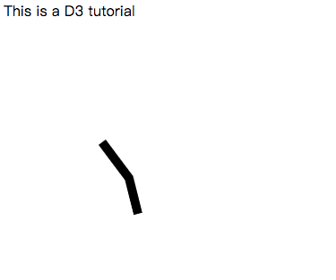

# D3 Tutorial - Notes 
- This note is based on a d3 tutorial on youtube called [d3Vienno](https://www.youtube.com/user/d3Vienno/videos).
- The tutorial consists of 20 videos introducing select, style, bind, scale, group, transform , path and other contents of d3. 
- Codes are provided with comments and screenshots are provided for a easier understanding of the code. You can comment/uncomment the code to see the change.
- This note can be a good complement if you want to learn more about d3.

### Chapter 1: Introduction of HTML

```js
<html>
<head>
	<title>D3 Tutorial</title>
	<script src="https://d3js.org/d3.v5.min.js"></script>
	<script src="https://d3js.org/d3-scale.v2.min.js"></script>
	<script src="https://d3js.org/d3-axis.v1.min.js"></script>
</head>
<body>
	<p>This is a D3 tutorial</p>
	<script>
    </script>
</body>
</html?
```

### Chapter 2: Select and style text

```js
d3.select("p").text("Hello World!");  //change the text to Hello World
d3.select("body")
    .append("p")
    .style("color", "red")  // a way to decorate text by css
    .text("Hi, what's up?");
```


### Chapter 3: Create SVG

```js
var canvas = d3.select("body")
                .append("svg")
                .attr("width", 500)  // when styling svg we use attr instead of style
				.attr("height", 500);
var circle = canvas.append("circle")
                .attr("cx", 250)
                .attr("cy", 250)
                .attr("r", 50)
                .attr("fill", "red");
var rect = canvas.append("rect")
                .attr("width", 100)
                .attr("height", 50)
                .attr("fill", "blue");
var line = canvas.append("line")
                .attr("x1", 0)
                .attr("y1", 100)
                .attr("x2", 400)
                .attr("y2", 400)
                .attr("stroke", "green")
                .attr("stroke-width", 2);
```


### Chapter 4: Bind data

```js
var canvas = d3.select("body")
                    .append("svg")
                    .attr("width", 500) 
                    .attr("height", 500);
var dataArray = [20, 30, 50];
var bars = canvas.selectAll("rect")
					.data(dataArray)
					.enter()  // select placeholder 
                        .append("rect")
                        .attr("width", function(d) { return d*10; })
                        .attr("height", 50)
                        .attr("y", function(d, i) { return i*200; });
```


### Chapter 5: Scale length and color

```js
var dataArray = [10, 20, 40, 60] // when width*10 is large than canvas width
var width = 500;
var height = 500;
var canvas = d3.select("body")
                .append("svg")
                .attr("width", width) 
                .attr("height", height);
var widthScale = d3.scaleLinear() // create a linear scaler
                    .domain([0, 60]) // set range as min and max
                    .range([0, width]); // set range as min and max from canvas

var color = d3.scaleLinear()
                .domain([0, 60])
                .range(['red','blue']);  // change color from red(0) to blue(60) with repect to value
var bars = canvas.selectAll("rect")
                    .data(dataArray)
                    .enter()  // select placeholder 
                        .append("rect")
                        .attr("width", function(d) { return widthScale(d); })  // scale by width
                        .attr("height", 50)
                        .attr("fill", function(d) {return color(d)}) // scale by color
                        .attr("y", function(d, i) { return i*60; }); 
```


### Chapter 6: Group and axis

```js
var dataArray = [10, 20, 40, 60] // when width*10 is large than canvas width
var width = 500;
var height = 500;
var widthScale = d3.scaleLinear() // create a linear scaler
                    .domain([0, 60]) // set range as min and max
                    .range([0, width]); // set range as min and max from canvas
var color = d3.scaleLinear()
				.domain([0, 60])
				.range(['red','blue']);  // change color from red(0) to blue(60) with repect to value
var axis = d3.axisTop()
			.ticks(5)  // set number of ticks
			.scale(widthScale);
var canvas = d3.select("body")
				.append("svg")
				.attr("width", width) 
				.attr("height", height)
				.append("g")  // add a group tag
				.attr("transform", "translate(20, 0)")  // change the location of bars, move left by 20	
var bars = canvas.selectAll("rect")
					.data(dataArray)
					.enter()  // select placeholder 
						.append("rect")
						.attr("width", function(d) { return widthScale(d); })  // scale by width
						.attr("height", 50)
						.attr("fill", function(d) {return color(d)}) // scale by color
						.attr("y", function(d, i) { return i*60; }); 
canvas.append("g")  // create a new group tag
		.attr("transform", "translate(0, 250)") // change the location of axis, move bottom by 250 
		.call(axis);
```


### Chapter 7: Enter, update and exit

```js
var data = [10];
var canvas = d3.select("body")
                .append("svg")
                .attr("width", 500)
                .attr("height", 500)
var circle1 = canvas.append("circle")
                .attr("cx", 50)
                .attr("cy", 150)
                .attr("fill", "red")
                .attr("r", 25);
var circle2 = canvas.append("circle")
                .attr("cx", 50)
                .attr("cy", 100)
                .attr("r", 25);
var circles = canvas.selectAll("circle")
                .data(data)
                .attr("fill", "yellow")
				.enter()  // select enter 
                    .append("circle")
                    .attr("cx", 50)
                    .attr("cy", 50)
                    .attr("fill", "blue")
                    .attr("r", 25)
var circles = canvas.selectAll("circle")
                .data(data)
                .attr("fill", "red")
				.exit()  // select exit, no append needed
                    .attr("cx", 50)
                    .attr("cy", 50)
                    .attr("fill", "green")
                    .attr("r", 25)
```


### Chapter 8: Transitions

```js
var canvas = d3.select("body")
                .append("svg")
                .attr("width", 500)
                .attr("height", 500);
var circle = canvas.append("circle")
                    .attr("cx", 50)
                    .attr("cy", 50)
                    .attr("r", 25);
circle.transition()
        .duration(1500)
        .delay(2000)
        .attr("cx", 150)
        .transition()
        .attr("cy", 150)
        .on("end", function() { d3.select(this).attr("fill", "red"); }); // add an end function
```

- Screenshots are not provided for this chapter since they are animations in html.

### Chapter 9: Working with array

Some useful array operations in Javascript:

```js
var data = [10, 20, 30, 40, 50];
// some operations on array
d3.sum(data);
d3.extent(data);  // get the min and max number in array 
d3.median(data);
d3.shuffle(data);  // shuffle the data
data.shift();  // get first number  
data.sort(d3.descending);  // sort the data in descening order
```

### Chapter 10: Loading exteral data

A way to load exteral json/csv data in D3:

```js
d3.json("mydata.json", function (error, data) 
		{
			var canvas = d3.select("body").append("svg")
							.attr("width", 500)
							.attr("height", 500)
			canvas.selectAll("rect")
				.data(data)
				.enter()
					.append("rect")
                	.attr("height", 30)
					.attr("width", function(d) { return d.age * 10 })
					.attr("fill", "blue")
					.attr("y", function(d, i) {return i* 50})
			}
);
```

### Chapter 11: Path 

```js
var canvas = d3.select("body").append("svg")
						.attr("width", 500)
						.attr("height", 500)
var data = [
    		{x: 10, y: 20},
			{x: 40, y: 60},
			{x: 50, y: 100}
];
var group = canvas.append("g")
					.attr("transform", "translate(100,100)");
var line = d3.line()
			.x(function (d) {return d.x; })
			.y(function (d) {return d.y; });
group.selectAll("path")
        .data([data])
        .enter()
        .append("path")
        .attr("d", line)
        .attr("fill", "none")
        .attr("stroke", "black")
        .attr("stroke-width", 10);
```



### Chapter 12: Arc

```js
var canvas = d3.select("body").append("svg")
						.attr("width", 500)
						.attr("height", 500)
var group = canvas.append("g")
					.attr("transform", "translate(100,100)");
var p = Math.PI * 2;
var r = 100;
var arc = d3.arc()
			.innerRadius(r-20)
			.outerRadius(r)
			.startAngle(0)
			.endAngle(p-1);
group.append("path")
			.attr("d", arc);
```


### Chapter 13: Pie chart

Pie charts are created on the basis of arcs:

```js
var data = [20, 50, 80];
var r = 200;
var color = d3.scaleOrdinal()
				.range(["red","blue","orange"]);
var canvas = d3.select("body").append("svg")
			.attr("width", 500)
		 	.attr("height", 500);
var group = canvas.append("g")
			.attr("transform", "translate(300,300)");
var arc = d3.arc()
			.innerRadius(0)  // if set less than r but greater than 0, it's a donut chart
			.outerRadius(r);
var pie = d3.pie()  // difference between version 4 & 3
			.value( function (d) { return d;});
var arcs = group.selectAll("arc")
                .data(pie(data))
                .enter()
                .append("g")
                .attr("class", "arc");
arcs.append("path")
		.attr("d", arc)
		.attr("fill", function (d) {return color(d.data); })
arcs.append("text")
		.attr("transform", function (d) { return "translate(" + arc.centroid(d) + ")"; } )
    .attr("text-anchor", "middle")
    .attr("font-size", "2em")
    .text(function (d) { return d.data; });
```


### Chapter 14 & 15: Tree layout

Trees are good for hierarchical data:

```js
var canvas = d3.select("body").append("svg")
				.attr("width", 500)
	 			.attr("height", 500);
var tree = d3.layout.tree()
				.size([400,400])
d3.json("mydata.json"), function (data) {
var nodes = tree.nodes(data);
var links = tree.links(nodes);
var node = canvas.selectAll(".node")
					.data(nodes)
					.enter()
					.append("g")
						.attr("class", "node")
						.attr("transform", function(d) {return "translate(" + d.y + "," + d.x + "," + ")"; })  // horizontal linked
node.append("circle")
		.attr("r", 5)
		.attr("fill", "steelblue");
node.append("text")
		.text(function (d) {return d.name;})  // add text
var diagonal = d3.svg.diagonal()  // version 3
					.projection(function (d) {return [d.y, d.x];})
canvas.selectAll(".link")
        .data(links)
        .enter()
        .append("path")
        .attr("fill", "none")
        .attr("stroke", "#ADADAD")
        .attr("d", diagonal);
}
```


### Chapter 16: Cluster, pack layouts

More layouts for representing data in d3 (data are the same as previous chapter):

```js
var width = 800, height = 600;
var tree = d3.layout.cluster()
				.size([400,400])

var pack = d3.layout.pack()
			.size([width, height-50]) 
			.padding(10);
```


### Chapter 17 & 18: Histogram

The code read a csv file which consists of two columns, name and age.

```js
var width = 500, height = 500, padding = 50;
d3.csv("ages.csv", function (data) {
var map = data.map(function (i) {
		return i.age; // return age for each element
	})
var histogram = d3.layout.histogram()
					.bins(5)  // setup bins for histogram
					(map)  // store them in array
var y = d3.scale.linear()
	        .domain([0, d3.max(histogram.map(function (i) {return i.length;}))]) // get the maximum value
			.range([0, height + padding]);
var x = d3.scale.linear()
				.domain([0,d3.max(map)])
				.range([0, width])
var xAxis = d3.svg.axis()
				.scale(x)
				.orient("bottom")

var canvas = d3.select("body").append("svg")
				.attr("width", width)
				.attr("height", height+padding);
var group = canvas.append("g")
				.attr("transform", "translate(" + height + ")")
				.call(xAxis);
var bars = canvas.selectAll(".bars")
					.data(histogram)
					.enter（）
					.append("g")
bars.append("rect")
	.attr("x", function (d) {return d.x;})
	.attr("y", function (d) { return 500 - y(d.y); }) // reverse the order 
	.attr("width", function (d) {return d.dx * 5;})
	.attr("height", function (d) {return d.y * 20 })
	.attr("fill", "steelblue")
})

```


